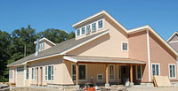
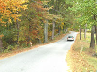
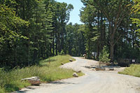
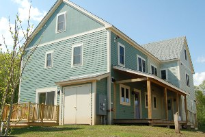

+++
title = "Welcome"
type = 'page'
+++

Are you looking for a new energy-efficient home in a great neighborhood? Check out our [Homes Available](/forsale) page.

**Our Neighborhoods**

- [Mosaic Commons](http://www.mosaic-commons.org)
- [Camelot Cohousing](http://www.camelotcohousing.com/)

## EcoVillages

Sawyer Hill EcoVillage uses the best practices of sustainable development and land planning. Our homes are clustered to reduce our footprint, so that over 75% of our 65 acre site can be left as open space, including more than 25 acres of permanent conservation land. Common facilities and a close community encourages sharing of resources and low vehicle use. The latest construction techniques ensure that our buildings are highly energy efficient. [Read more about our EcoVillage](/ecovillages)

## Our town

[Berlin](http://townofberlin.com/) is a picturesque New England town of about 3100 people. Its idyllic rural feel belies its convenient location near the intersection of routes 495 and 290, just 45 minutes from Boston and 20 minutes from Worcester. Berlin is nestled in in a low range of hills between the Nashua and the Assabet River Valleys, and boasts excellent schools and easy access to shopping, dining and entertainment. Incorporated in 1812, the town has a rich history of agriculture, manufacturing and lumber. Sawyer Hill EcoVillage is located at [46 Sawyer Hill Road](http://maps.google.com/maps?f=q&hl=en&geocode=&q=46+sawyerhill+road+berlin+ma).

## Affordable Housing

Sawyer Hill EcoVillage was developed under the Massachusetts "40B" affordable housing law. Seventeen of our 68 homes are set aside for income-qualified buyers through a state-regulated system.

## Cohousing

Sawyer Hill EcoVillage is comprised of two [cohousing](/cohousing) neighborhoods, [Mosaic Commons](http://www.mosaic-commons.org) and [Camelot Cohousing](http://www.camelotcohousing.com/). Cohousing is a modern style of residential neighborhood in which some resources are shared in common by the residents. Each family owns their home, as well as a share of the common facilities, which include things like playing fields and gardens. Our community values green space, a safe, healthy environment for our children and conservation of our natural resources. The cohousing development model began in Denmark during the late 1960s, and has since become a mainstream housing option in that country. This innovative neighborhood design crossed the Atlantic in the late 1980s, and over 50 successful communities have built all over the United States since that time, with many others that have purchased land and are in the development process. There are ten completed cohousing communities in Massachusetts and at least two others in the development or construction phase. [Read more about Cohousing](/cohousing)

