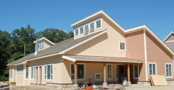
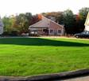
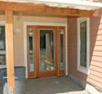
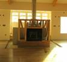

+++
title = "Camelot Common House"
+++

{.align-right width="400"}

The Common House at Camelot Cohousing is the center of our neighborhood, both physically and socially. It's the place where the community comes together -- for shared meals, for games and entertainment, for meetings, for parties, for hobbies and activities.

### Our Common House provides:

- *Spectacular Great Room* for optional shared meals and large events. Features soaring clerestory ceiling, two-sided tiled fireplace, bamboo floor.
- *Large Commercial-quality Kitchen* with gas ranges, two ovens and refrigerators, and commercial dishwasher
- *Children's Playroom* with window into the great room, so parents can easily "check in"
- *Multi-use "Dojo"* for dance, yoga, meditation, aerobics, music, etc.; expansion space from the great room for larger events
- *Cozy Living / TV room* for shared viewing and casual socializing
- *Exercise Room* with gym quality equipment
- *Four additional rooms* for hobbies, meetings, sewing & crafts, games, etc.
- *Herb Garden* off the kitchen, in addition to large shared community garden
- *South facing deck for outdoor dining and sunning*, with easy access to multiple rooms
- *Easy access from both floors to heated swimming pool,* including spacious screened back deck
- *Built for accessibility:* elevator and handicapped accessible bathroom with shower
- *Paved courtyard* for outdoor cooking, patio tables and children's play
- Entryway with mail boxes and coat area
- Internet service
- Low-toxicity and environmentally responsible building materials
- Well insulated 2x6 construction & lots of natural light, just like all our individual homes

All residents have full use of the common house. It's like having a luxury recreational facility next door to enjoy with neighbors and friends.

{.align-center}

{.align-center}

{.align-center}
