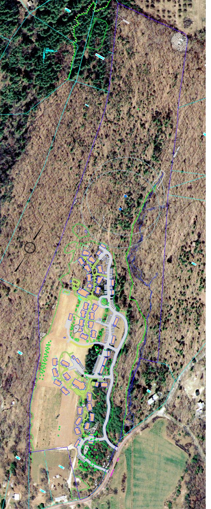
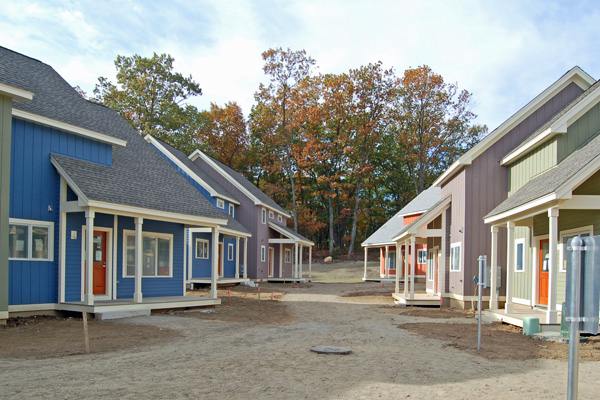

+++
title = "What is Cohousing?"
+++

Cohousing is a type of collaborative housing in which residents actively participate in the design and operation of their own neighborhoods. Cohousing residents are consciously committed to living as a community. The physical design encourages both social contact and individual space. Private homes contain all the features of conventional homes, but residents also have access to common facilities such as open space, courtyards, a playground and a common house.

**The six defining characteristics of cohousing are:**

**1. Participatory process.** Future residents participate in the design of the community so that it meets their needs. Some cohousing communities are initiated or driven by a developer. In those cases, if the developer brings the future resident group into the process late in the planning, the residents will have less input into the design. A well-designed, pedestrian-oriented community without significant resident participation in the planning may be "cohousing-inspired," but it is not a cohousing community.

**2. Neighborhood design.** The physical layout and orientation of the buildings (the site plan) encourage a sense of community. For example, the private residences are clustered on the site, leaving more shared open space. The dwellings typically face each other across a pedestrian street or courtyard, with cars parked on the periphery. Often, the front doorway of every home affords a view of the common house. What far outweighs any specifics, however, is the intention to create a strong sense of community, with design as one of the facilitators.

**3. Common facilities.** Common facilities are designed for daily use, are an integral part of the community, and are always supplemental to the private residences. The common house typically includes a common kitchen, dining area, sitting area, children's playroom and laundry, and also may contain a workshop, library, exercise room, crafts room and/or one or two guest rooms. Except on very tight urban sites, cohousing communities often have playground equipment, lawns and gardens as well. Since the buildings are clustered, larger sites may retain several or many acres of undeveloped shared open space.

**4. Resident management.** Residents manage their own cohousing communities, and also perform much of the work required to maintain the property. They participate in the preparation of common meals, and meet regularly to solve problems and develop policies for the community.

**5. Non-hierarchical structure and decision-making.** Leadership roles naturally exist in cohousing communities, however no one person (or persons) has authority over others. Most groups start with one or two "burning souls." As people join the group, each person takes on one or more roles consistent with his or her skills, abilities or interests. Most cohousing groups make all of their decisions by consensus, and, although many groups have a policy for voting if the group cannot reach consensus after a number of attempts, it is rarely or never necessary to resort to voting.

**6. No shared community economy.** The community is not a source of income for its members. Occasionally, a cohousing community will pay one of its residents to do a specific (usually time-limited) task, but more typically the work will be considered that member's contribution to the shared responsibilities. *Reproduced with permission from [www.cohousing.org](//www.cohousing.org)*

{.align-center}
