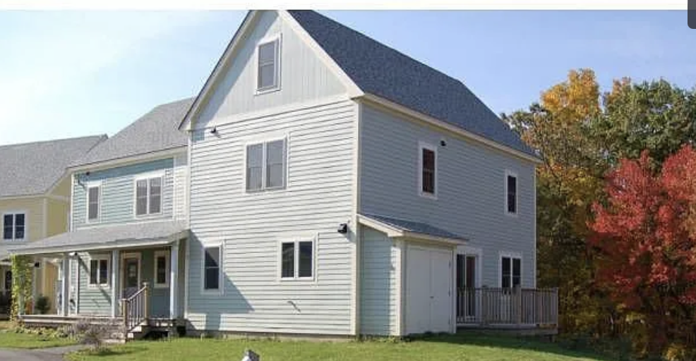

+++
title = "35 Village Lane - 4BR - Mosaic Commons"
+++

<h2 align="center">4 Bedroom Townhouse with Basement $625,000</h2>

[See more photos](https://drive.google.com/drive/folders/1mGXyJovZhKbqwyu6uWWSsaBKyVejKT4r?usp=share_link) or [contact info@mosaic-commons.org](mailto:info@mosaic-commons.org) to inquire.

35 Village Lane

4 bedroom, 2 bath condo, large kitchen with granite counters, walk up attic and walk out basement. Surprising amount of storage. Super-insulated unit, solar panels, heat pumps, low VOC construction. Shared front porch, private deck. A great place for families with kids, extended families, or collaborative households. Lots of common resources.

### Home Features

- End unit townhouse with great views
- Refurbished kitchen with granite counters and lots of shelving
- 1800 square feet (not including attic or basement)
- Bedroom on the first floor
- Supersized bedroom (possible living room) on the second floor
- Two additional bedrooms on the second floor
- Second floor laundry
- Large, shared porch
- Shed and two garden boxes
- Shelving available for storage for basement and attic
- Two full bathrooms with tub and showers.

### Room Dimensions

Living Room
: 16' x 12'

Dining Area
: 8'6" x 10'

Kitchen
: 10' x 10'

Master Bedroom
: 25' x 12' (includes walk-in closet)

Bedroom 2
: 9'6" x 15'6" (1st floor)

Bedroom 3
: 13'6" x 11'

Bedroom 4
: 12' x 11'6"

### Exterior Details

Exterior
: Hardiplank Siding

Roof
: Asphalt

Foundation
: Cement

Color
: Soft Green

Porch
: 6' x 22' (shared)

Water
: Association Well

Sewerage
: Association Septic

### Interior Details

Floors
: linoleum, painted plywood

Attic
: Walkup

Basement
: Walkout

Heat
: Electric baseboard (pellet stove, gas, heat pump optional)

Hot Water
: Electric (solar ready)

Electric
: Circ Breakers

Fire Suppression
: Sprinklers

### Common Resources

- Large common house with commercial kitchen
- A large gathering room (60+ people) and a smaller side room
- A living room/media room
- A shared laundry
- A kids room
- A multi-purpose room
- A bike room
- A fitness center
- A hot tub
- A common garden
- A playground and a basketball hoop
- A labyrinth
- Adjoins town conservation land with walking trails
- Beautiful rural area, yet close to 495, Mass Pike and Worcester

### Property Overview

Property Type
: Condo

Style
: Duplex

Built
: 2008

Living Sq. Ft.
: 1800 sq. ft.

Rooms
: 7

Bedrooms
: 4

Baths
: 2
